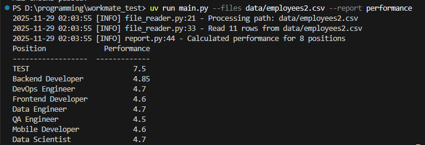
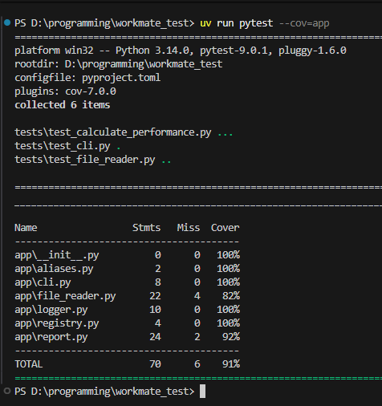

# CSV Reporting Tool

A simple console tool for generating reports from CSV files.

---

## Setup

### 1. Clone the project


```bash
git clone https://github.com/Mixaqi/workmate_test_task
```

### 2. Navigate into the project folder
```bash
cd workmate_test_task
```

### 3. Run uv sync to install dependencies
```bash
uv sync
```

### Simple usage
```bash
uv run main.py --files data/employees2.csv --report performance
```


### Commands to format
## format code
```bash
uv run ruff format
```
## format imports
```bash
uv run ruff check --fix --select I
```

### Tests
```bash
uv run pytest
```

### Tests coverage
```bash
uv run pytest --cov=app
```
